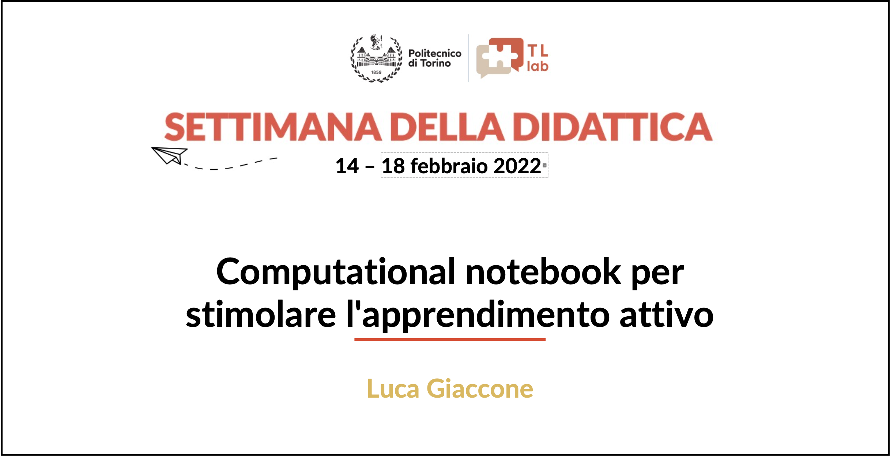

# Computational Notebook: esempi

Questo repository contiene tutti gli esempi di computational notebook presentati il 14.02.2022 durante l'evento "la settimana della didattica" nell'intervento:

**Computational notebook per stimolare l'apprendimento attivo**
*Luca Giaccone* [(luca.giaccone@polito.it)](mailto:luca.giaccone@polito.it)

(testo della presentazione dispobinile nel repository in formato PDF)

## Breve descrizione dei Notebook

### Jupyter Notebook
1. `notebook_example1.ipynb` : Jupyter Notebook in linguaggio Python che visualizza le forme d'onda di potenza in regime sinusoidale. E' possibile avviarlo senza nessuna configurazione usando [*Google Colaboratory*](https://colab.research.google.com/)
2. `notebook_example2.ipynb` : Jupyter Notebook in linguaggio Python che visualizza il diagramma fasoriale di un rifasamento elettrico. E' possibile avviarlo senza nessuna configurazione usando [*Google Colaboratory*](https://colab.research.google.com/)
3. `notebook_example3.ipynb` : Jupyter Notebook in linguaggio Python che visualizza un campo vettoriale. E' possibile avviarlo senza nessuna configurazione usando [*Google Colaboratory*](https://colab.research.google.com/)
4. `notebook_example4.ipynb` : Jupyter Notebook in linguaggio Python che visualizza graficamente il *metodo delle tangenti*. E' possibile avviarlo senza nessuna configurazione usando [*Google Colaboratory*](https://colab.research.google.com/)

### Live Script MATLAB
1. `notebook_example1.mlx` : Live Script MATLAB che visualizza le forme d'onda di potenza in regime sinusoidale. E' necessario il software MATLAB per poterlo eseguire.

### Gogebra
1. `notebook_example1.ggb` : file importbile in Geogebra che visualizza le forme d'onda di potenza in regime sinusoidale. E' possibile importarlo accedendo al software nella sua [versione cloud based](https://www.geogebra.org/calculator)
2. Esempi di progetti più struttirati: [link1](http://polilabhome.polito.it/2021/03/28/moto-armonico-esercizio-con-simulazione/), [link2](http://polilabhome.polito.it/2021/03/25/collisioni-nucleari-1/)